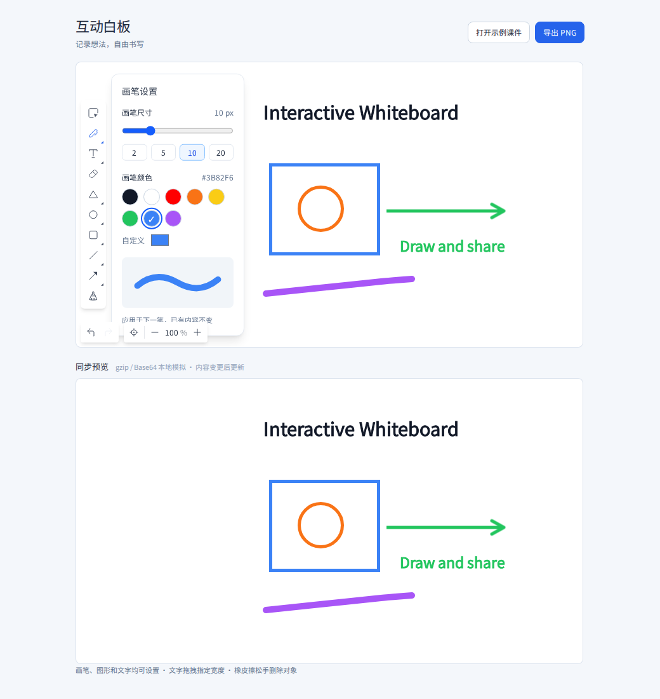

# Interactive Whiteboard

A whiteboard demo built with Vue 3, TypeScript, Fabric 7, and Tailwind CSS 4. It includes drawing tools, text, an eraser, slide navigation, and a synchronized preview.

[简体中文](README.md)

## Demo



## Features

- Draw with a pen, line, open arrow, rectangle, circle, or triangle. Set colors and stroke widths; set the color and size of text.
- Click to type at the pointer, or drag to define a text region. While dragging the eraser, objects under the pointer fade; they are deleted when you release it, with a short eraser trail.
- Undo and redo, copy and paste objects, move them with the arrow keys, delete them, and export a PNG.
- Browse bundled JPEG slides. Annotations and undo history are saved separately for each slide. This is not a PPTX parser.
- Preview the whiteboard in the second canvas using a local gzip and Base64 encode/decode round trip.
- Use the same 800 × 450 logical canvas on desktop and mobile; the canvas scales to the available width and the toolbar becomes horizontal on narrow screens.

## Getting started

Requires Node.js 24+ and pnpm 10.20.0.

```sh
pnpm install --frozen-lockfile
pnpm dev
```

Open the URL printed by Vite. No backend is required. Whiteboard content is kept in memory for the current session; export a PNG before refreshing if you need to keep it.

## How to use

- Choose the pen, a shape, or text to open its settings. Click the active tool again to toggle the panel. The eraser has no settings. Changes apply to newly created objects only.
- Click to enter text with a blinking caret, or drag to set its wrapping width. Leaving an empty text object removes it.
- Drag the eraser over objects to mark them for deletion; release to remove them. Undo can restore deleted objects. Partial pixel erasure is not supported.
- Use `Ctrl/⌘+Z` to undo, `Ctrl+Y` or `Ctrl/⌘+Shift+Z` to redo, and `Ctrl/⌘+C/V` to copy and paste. Use arrow keys to move selected objects and `Delete/Backspace` to remove them.
- Clear annotations while keeping the current slide background. Deleting a slide requires confirmation and cannot be undone. PNG export requires image sources that allow cross-origin access.

## How the preview works

When content changes, the main canvas serializes a Fabric JSON snapshot and simulates this transfer:

```text
Main canvas JSON → gzip → Base64 string → Base64 decode → ungzip → preview canvas
```

`src/utils/previewSync.ts` handles the local encoding and decoding; comments mark potential send and receive points for a future WebSocket integration. `src/core/preview.ts` loads snapshots into the preview in sequence and cleans up resources. There is no WebSocket connection or server, no network delay simulation, and no multiplayer support. Pointer movement and eraser trails do not send full snapshots.

Styles enter through `src/styles/index.css`. The page and toolbar mostly use Tailwind classes in Vue templates; component-specific icons live with their components, while shared assets and slides live in `src/assets/`. Vite and Vue declarations are in `src/types/`.

## Development and checks

```sh
pnpm lint
pnpm format:check
pnpm test
pnpm build
pnpm exec playwright install chromium --only-shell
pnpm test:browser
```

The tests cover history, settings, arrow serialization, and the gzip/Base64 round trip. Browser checks exercise drawing, synchronized preview, slides, export, and mobile layout. CI runs these checks with Node.js 24.

For project conventions, see [AGENTS.md](AGENTS.md). The change history is in the [adjustment plan](docs/adjustment-plan.md).

## License

Released under the [MIT License](LICENSE).
